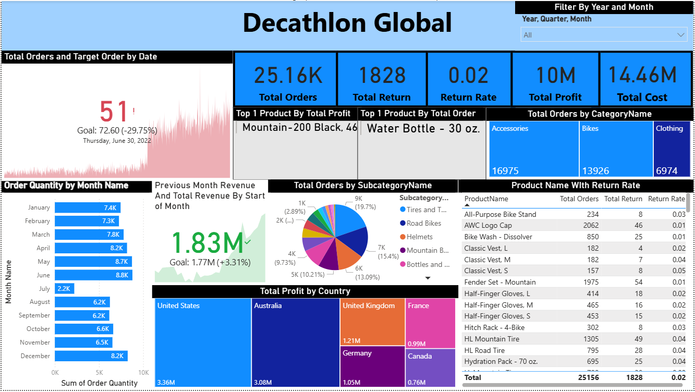
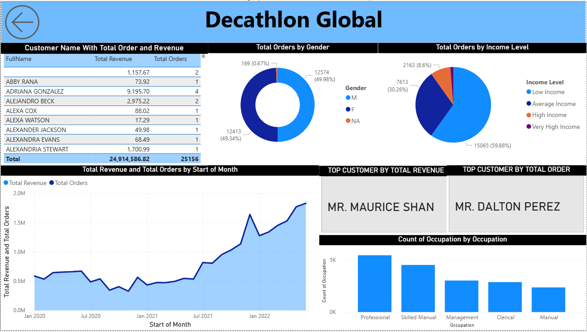
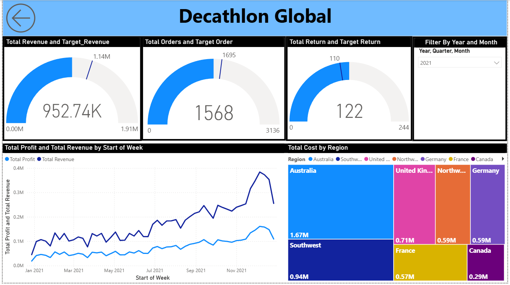
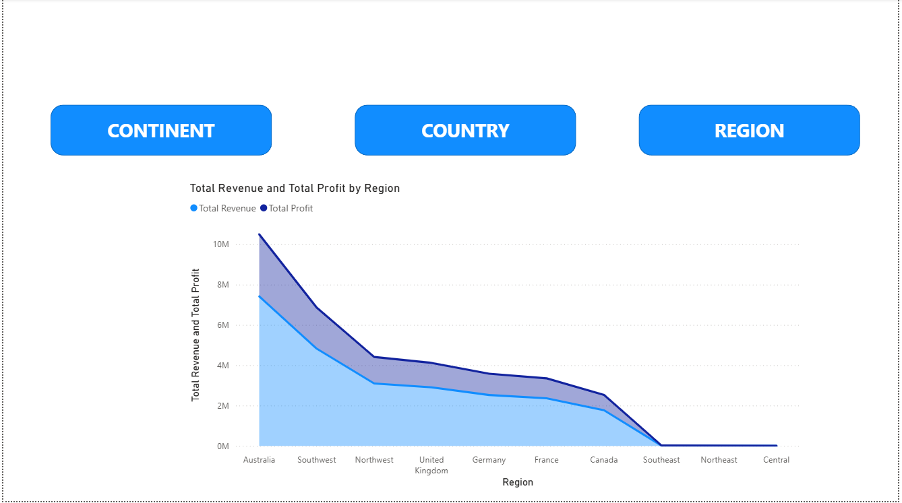
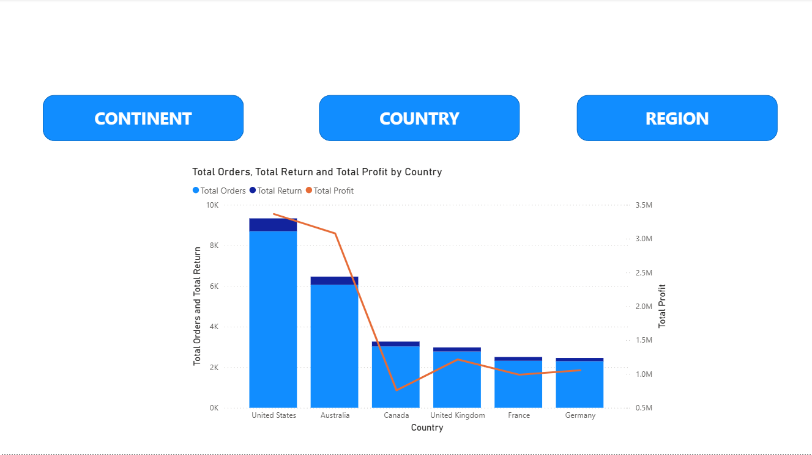
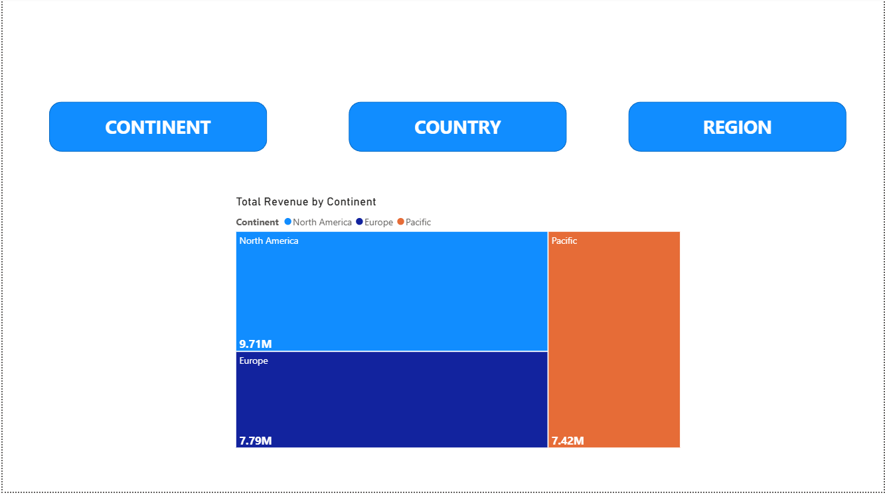

# Decathlon Sales Analytics Project | Power BI

## Project Overview

This project focuses on analyzing sales performance, customer behavior, product performance, and regional trends for a retail business using **Power BI**.

The objective of this project was to transform raw sales data into meaningful business insights through **interactive dashboards, KPI tracking, dynamic filtering, drill-through analysis, and advanced DAX calculations**.

The solution was designed to help stakeholders monitor **revenue, profit, orders, returns, customer purchasing behavior, product performance, and regional contribution** to support better business decision-making.

---

## Business Problem

Retail businesses generate large volumes of transactional data, making it difficult to monitor KPIs, identify trends, and evaluate performance across customers, products, and regions.

This project was built to:

- Monitor sales and profitability performance
- Analyze customer purchasing behavior
- Track regional sales contribution
- Compare historical performance
- Improve business visibility through interactive reporting

---

## Tools & Technologies Used

- **Power BI Desktop**
- **Power Query (ETL & Data Transformation)**
- **DAX (Data Analysis Expressions)**
- **Power BI Service**
- **Data Modeling (Star Schema)**
- **Microsoft Excel**

---

## Data Cleaning & Transformation (Power Query)

Performed extensive data cleaning and transformation to improve data quality and reporting accuracy.

### Cleaning & Preparation Activities:
- Corrected inconsistent **data types and formats**
- Handled **missing values and data quality issues**
- Removed/managed **errors in data**
- Standardized columns for reporting consistency
- Transformed raw data into analysis-ready format

### Calendar Table Creation:
Created a dedicated **Calendar Table** to support time intelligence analysis.

Generated custom date columns such as:

- Year
- Month
- Month Name
- Day Name
- Week Start Date
- Date Hierarchies

This enabled better trend analysis and time-based reporting.

---

## Data Modeling

Implemented an optimized **Star Schema Data Model** to improve report performance and maintain scalable relationships.

### Model Structure

### Fact Table
- Sales Transactions

### Dimension Tables
- Customer
- Product
- Geography
- Calendar/Date Table

### Hierarchies Created
Created custom hierarchies for enhanced drill-down analysis:

#### Date Hierarchy
- Year
- Month
- Day

#### Regional Hierarchy
- Continent
- Country
- Region

These hierarchies enabled seamless navigation between high-level and granular insights.

---

## DAX Measures Created

Developed multiple business KPI measures using **DAX** to support dynamic reporting and analysis.

### Revenue & Profit Measures
- Total Revenue
- Total Profit
- Total Cost
- Profit Margin %

### Order & Return Measures
- Total Orders
- Total Returns
- Return Rate

### Historical Comparison Measures
- Previous Month Revenue
- Previous Month Orders
- Previous Month Returns

### Target KPI Measures
- Target Revenue
- Target Orders
- Target Returns

### Product Performance Measures
- Top Product by Orders
- Top Product by Profit

These measures enabled dynamic KPI tracking and comparative performance analysis.

---

## Dashboard Pages

### 1. Sales Insights Dashboard

Provides a complete overview of business performance through KPI tracking and trend analysis.

### Features Implemented:
- KPI Cards for Revenue, Profit, Orders, and Returns
- Dynamic slicers for filtering insights
- Monthly performance analysis
- Year-over-Year trend tracking

### Advanced Feature:
Implemented a **Custom Tooltip Page** for the **Order Quantity by Month Name Chart** to provide additional contextual insights on hover.



---

### 2. Customer Dashboard

Focused on customer-level performance and purchasing behavior.

### Insights Included:
- Top Customers
- Customer Contribution Analysis
- Purchase Behavior Trends
- Revenue Contribution



---

### 3. Product Dashboard

Analyzes product performance, cost contribution, and profitability.

### Features Implemented:
- Product performance comparison
- Revenue and profit analysis
- Product category insights

### Advanced Feature:
Implemented **Drill-Through Functionality** for the **Total Cost by Region Chart**, enabling users to navigate into detailed product-level insights.



---

### 4. Regional Dashboard

Designed an interactive geographical analysis dashboard to evaluate sales performance across different locations.

### Features Implemented:
- Region-wise analysis
- Country-wise analysis
- Continent-wise analysis

### Interactive Navigation:
Implemented **Buttons & Bookmarks** to dynamically switch between:

- Continent View
- Country View
- Region View

This allowed users to focus on one geographical level at a time for better readability and analysis.

### Navigation Feature:
Added a **Back Button** for smooth dashboard navigation and better user experience.

### By Region



### By Country



### By Continent



---

## Interactive Features Implemented

- Dynamic slicers for filtering
- Custom tooltips
- Drill-through pages
- Buttons & bookmarks
- Dashboard navigation using back button
- KPI monitoring
- Drill-down hierarchies
- Dynamic DAX measures
- Interactive visual storytelling

---

## Report Deployment

Published the final Power BI report to **Power BI Service Workspace** for report sharing and centralized access.

---

## Key Learnings

Through this project, I strengthened my expertise in:

- Power BI Dashboard Development
- Power Query Data Transformation
- DAX Calculations
- Data Modeling using Star Schema
- Time Intelligence Analysis
- Interactive Dashboard Design
- Business KPI Reporting
- Drill-through & Tooltip Design
- Bookmark & Button Navigation
- Report Publishing using Power BI Service

---

## Repository Structure

```text
Decathlon Sales Analytics Project
│── Dashboard_Screenshots/
│   ├── Sales_Insights_Dashboard.png
│   ├── Customer_Dashboard.png
│   ├── Product_Dashboard.png
│   ├── Regional_Data_By_Region.png
│   ├── Regional_Data_By_Country.png
│   └── Regional_Data_By_Continent.png
│
│── Dataset/
│── Decathlon_Dashboard.pbix
│── README.md
```

---

## Author

**Aniket Panpatil**  
Data Analyst | Power BI Developer | SQL Developer
