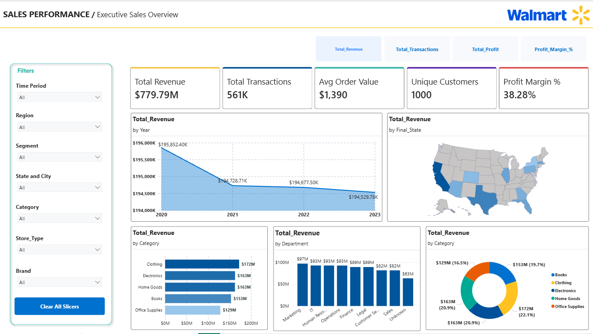
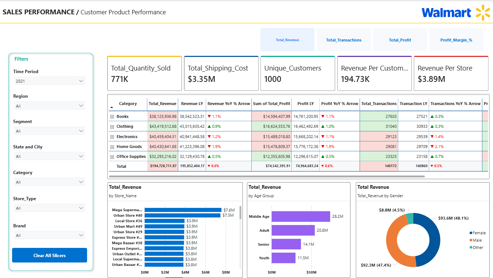
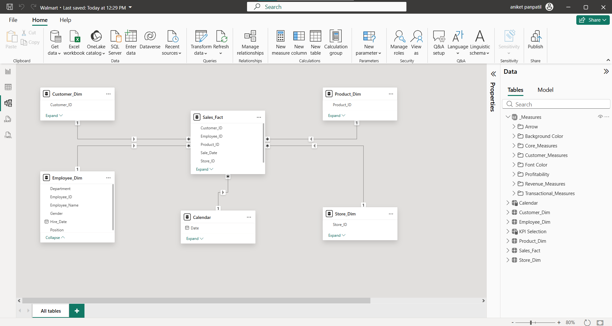

# Walmart Sales Analytics Dashboard | Power BI

An end-to-end **Power BI Sales Analytics Dashboard** developed for a Walmart retail business scenario to centralize reporting, monitor KPIs, and enable self-service analytics across **561K+ transactions**, **52 stores**, and multiple product categories.

This project transforms raw retail data into actionable business insights through **interactive dashboards, KPI tracking, YoY analysis, dynamic filtering, customer segmentation, and product performance analytics**.

---

## Dashboard Preview

### Executive Sales Overview



### Customer & Product Performance Analysis



---

## Key Highlights

✔️ **561K+ Sales Transactions Analyzed**  
✔️ **52 Retail Stores Covered**  
✔️ **2020–2023 Sales Analysis**  
✔️ **Star Schema Data Modeling**  
✔️ **Advanced DAX Measures & Time Intelligence**  
✔️ **Dynamic KPI Switching using Field Parameters**  
✔️ **YoY Performance Analysis**  
✔️ **Conditional Formatting using DAX**  
✔️ **Bookmark Navigation & Clear Slicers**  
✔️ **Interactive Self-Service Reporting**

---

## Business Problem

Walmart lacked a centralized reporting system to monitor business performance across stores and regions.

### Key Challenges

- Leadership lacked a **single trusted view** of revenue, profit, and business growth.
- Regional managers struggled to compare **store and category performance** across territories.
- Marketing and finance teams relied on **manual spreadsheet-based reporting**, slowing down decision-making.
- Business teams required a **self-service analytics solution** for faster operational and strategic decisions.

---

## Project Objective

The objective of this project was to build an **interactive Power BI Sales Analytics Dashboard** that:

- Centralizes sales, customer, product, and store data into a single reporting platform.
- Enables **real-time KPI monitoring** across revenue, profitability, and transactions.
- Supports **Year-over-Year (YoY) performance analysis**.
- Provides **regional, category, and customer-level insights**.
- Improves business decision-making through **interactive self-service reporting**.

---

## Dataset Overview

| Dataset | Records | Description |
|----------|----------|-------------|
| Sales Transactions | 561K+ | Sales data from 2020–2023 |
| Customer Data | 1,000+ | Customer demographics and segmentation |
| Product Catalogue | 500+ | Product category, sub-category, and brand information |
| Employee Data | 200+ | Employee and department information |
| Store Directory | 52 Stores | Store location, region, and store type |

### Business Coverage

- **Regions:** Central, East, South, West  
- **Product Categories:** Clothing, Electronics, Home Goods, Books, Office Supplies  
- **Timeline:** 2020 – 2023

---

## Tech Stack

- **Power BI Desktop**
- **Power Query**
- **DAX (Data Analysis Expressions)**
- **Excel**
- **Data Modeling**
- **Business Intelligence & Data Visualization**

---

## Data Cleaning & Transformation (Power Query)

Performed extensive data cleaning and transformation to improve reporting accuracy and data quality.

### Data Preparation Activities

- Corrected incorrect **data types** across multiple tables.
- Standardized text formatting using:
  - **Capitalize Each Word**
  - **Trim Function**
- Replaced **null values with "Unknown"** where required.
- Removed duplicate records from unique entity tables.
- Resolved missing **state values** using custom **city-state mapping logic**.
- Created separate mapping tables and merged them with source tables to restore missing geographical information.
- Removed unnecessary columns after transformation.
- Disabled load for intermediate mapping tables to improve model performance.

---

## Data Modeling

Designed and implemented a **Star Schema Data Model** to improve scalability, analytical efficiency, and report performance.

### Fact Table
- Sales_Fact

### Dimension Tables
- Customer_Dim
- Product_Dim
- Store_Dim
- Employee_Dim
- Calendar

### Data Modeling Features

- Implemented **one-to-many relationships** between fact and dimension tables.
- Created a **Calendar Table using DAX** for time intelligence analysis.
- Built custom date hierarchy including:
  - Year
  - Month Name
  - Quarter
  - Day Name
  - Day Number
  - Week Number

### Data Model Preview



---

## Calculated Columns & Business Logic

Created custom calculated columns to support profitability analysis and customer segmentation.

### Custom Calculations

- Total Product Cost
- Total Profit
- Age Group Segmentation

### Profit Logic

```DAX
Profit = Total Price - Product Cost - Shipping Cost
```

### Customer Age Groups

Created customer segmentation based on age:

- Youth
- Adult
- Middle Age
- Senior

---

## DAX Measures Implementation

Developed multiple DAX measures for KPI tracking, profitability analysis, customer insights, and Year-over-Year comparison.

### Core Measures

- Avg_Order_Value
- Total_Stores
- Total_Quantity_Sold
- Total_Revenue
- Total_Shipping_Cost
- Total_Transactions

### Revenue Measures

- Revenue LY
- Revenue YoY %
- Revenue Per Store

### Profitability Measures

- Total Profit
- Profit Margin %
- Profit LY
- Profit Margin LY %
- Profit YoY %

### Transaction Measures

- Transaction LY
- Transaction YoY %

### Customer Measures

- Revenue Per Customer
- Total Customer
- Unique Customers

### Conditional Formatting Measures

Created custom DAX measures for:

- Dynamic Background Colors
- Dynamic Font Colors
- YoY Arrow Indicators
- Revenue Growth Comparison
- Profitability Trend Indicators
- Transaction Trend Indicators

This enabled stakeholders to instantly identify **positive and declining business performance** through dynamic visual indicators.

---

## Dashboard Overview

### 1. Executive Sales Overview

Designed for **Senior Leadership** to monitor business performance at a high level.

#### Features

- KPI Cards:
  - Total Revenue
  - Total Transactions
  - Average Order Value
  - Unique Customers
  - Profit Margin %

- Revenue trend analysis using **drill-down date hierarchy**
- State-wise performance using **Shape Map**
- Category and department-level performance analysis
- Dynamic KPI switching using **Field Parameters**
- Interactive filtering across visuals

#### Dashboard Preview


---

### 2. Customer & Product Performance Analysis

Designed for **Regional Managers and Marketing Teams** to analyze customer behavior and product performance.

#### Features

- Category-wise performance matrix
- Year-over-Year comparison
- Conditional formatting using DAX
- Revenue analysis by:
  - Store
  - Gender
  - Age Group
- Customer segmentation analysis
- Dynamic KPI switching
- Matrix-based comparative analysis

#### Matrix Enhancements

✅ Green indicators for positive YoY performance  
✅ Red indicators for declining performance  
✅ Dynamic background colors using DAX  
✅ YoY directional arrows for performance tracking

#### Dashboard Preview


---

## Interactive Features

The dashboard includes:

- **Dynamic KPI Selection using Field Parameters**
- **Bookmark Navigation**
- **Clear All Slicers Button**
- **Cross-Filtering Between Visuals**
- **Drill-Down Analysis**
- **Dynamic Slicers**
- **YoY Trend Analysis**
- **Conditional Formatting**
- **Interactive Shape Map**
- **Self-Service Reporting Experience**

---

## Filters Used

Users can dynamically filter report data using:

- Time Period
- Region
- Segment
- State & City
- Product Category
- Store Type
- Brand

Filters remain synchronized across dashboard pages for seamless analysis.

---

## Business Impact

- Built a **centralized self-service analytics solution** replacing fragmented spreadsheet-based reporting.
- Enabled monitoring of **$779M+ revenue**, **561K+ transactions**, and profitability through KPI-driven reporting.
- Improved business visibility through **Year-over-Year performance comparison**.
- Enabled regional managers to analyze **store, category, and customer performance in real time**.
- Improved reporting efficiency through **interactive filtering and drill-down analytics**.
- Optimized dashboard performance using **Star Schema modeling, field parameters, and disabled intermediate table loads**.

---

## Skills Demonstrated

**Power BI** • **DAX** • **Power Query** • **Data Modeling** • **Star Schema** • **Business Intelligence** • **Dashboard Development** • **Data Cleaning** • **KPI Design** • **Time Intelligence** • **YoY Analysis** • **Conditional Formatting** • **Interactive Reporting**

---

## Repository Structure

```text
Walmart Sales Analytics Power BI Project/
│── README.md
│── Walmart Sales Analytics Power BI Project.pbix
│
├── Dashboard_Screenshots/
│   ├── Executive_Sales_Overview.png
│   ├── Customer_Product_Performance.png
│   ├── Data_Model.png
│
├── Business_Documents/
│   ├── Walmart_BRD.pdf
│   ├── Walmart_Developer_Guidelines.pdf
│
├── Dataset/
│   └── Walmart_Source_Data.xlsx
```

⭐ If you found this project valuable, feel free to explore the dashboard and repository.
